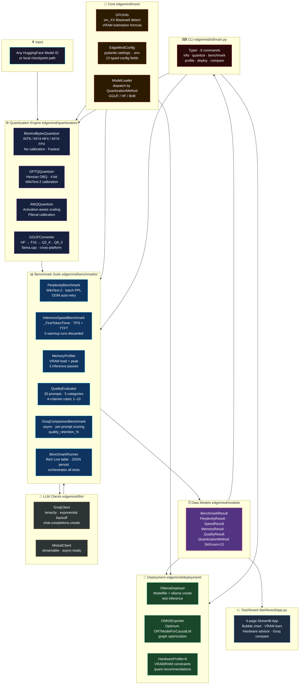

<div align="center">


<br/>

[](https://python.org)
[](https://pytorch.org)
[](#rtx-5090-blackwell-sm_120-setup)
[](#testing)
[](https://docs.astral.sh/ruff)
[](https://mypy-lang.org)
[](LICENSE)

<br/>


</div>

---

<div align="center">

## At a Glance

| | | | |
|:---:|:---:|:---:|:---:|
| **4** Quantization Algorithms | **4** Benchmark Dimensions | **8** Hardware Profiles | **34** Tests Passing |
| bitsandbytes · GPTQ · AWQ · GGUF | Perplexity · Speed · VRAM · Quality | RTX 5090 → Pi 5 | CPU-only CI/CD |
| **95%** Quality Retained at 3.5× Compression | **13** Quantization Methods (StrEnum) | **6** CLI Commands | **0** Ruff Violations |
| GPTQ INT4 vs BF16 baseline | BF16 to GGUF Q2_K | Typer + Rich output | Fully type-annotated |

</div>

---

## Table of Contents

1. [The Engineering Problem](#the-engineering-problem)
2. [What EdgeMind Solves](#what-edgemind-solves)
3. [System Architecture](#system-architecture)
4. [Quantization Algorithms — Deep Dive](#quantization-algorithms--deep-dive)
5. [Benchmark Suite — Four Dimensions](#benchmark-suite--four-dimensions)
6. [Performance Results](#performance-results)
7. [Hardware Deployment Profiles](#hardware-deployment-profiles)
8. [RTX 5090 Blackwell sm_120 Setup](#rtx-5090-blackwell-sm_120-setup)
9. [Installation](#installation)
10. [CLI Reference](#cli-reference)
11. [Streamlit Dashboard](#streamlit-dashboard)
12. [Configuration](#configuration)
13. [Project Structure](#project-structure)
14. [Testing](#testing)
15. [Engineering Highlights](#engineering-highlights)

---

## The Engineering Problem

<table>
<tr>
<td width="55%">

A **7B parameter** LLM at BF16 precision consumes **14 GB of VRAM**.
At 70B parameters, that is **140 GB** — more than five RTX 5090 cards.

Yet the hardware at the edge stays fixed:

| Device | Memory | Gap |
|---|---|---|
| Jetson Nano | 4 GB | Can't run 3B BF16 |
| Raspberry Pi 5 | 8 GB RAM | Can't run 1B FP16 |
| RTX 5090 | 24 GB VRAM | Can't run 13B BF16 |
| Mac M1 8GB | 8 GB unified | Can't run 7B BF16 |

**Post-training quantization (PTQ)** closes this gap — but four competing algorithms make different quality/size tradeoffs, and choosing blindly costs either VRAM or model quality.

EdgeMind makes this decision **scientific**: measure every dimension, compare against a cloud baseline, and let the data choose.

</td>
<td width="45%">

```
        VRAM Required vs Available
        ──────────────────────────
7B BF16 ████████████████░░░░  14.0 GB
        ─────────────── RTX 5090 limit (24 GB)

7B INT8 ████████░░░░░░░░░░░░   8.4 GB  ✓

7B GPTQ ████░░░░░░░░░░░░░░░░   4.2 GB  ✓✓

7B GGUF ████░░░░░░░░░░░░░░░░   4.6 GB  ✓✓
Q4_K_M

1B GGUF ██░░░░░░░░░░░░░░░░░░   0.9 GB  ✓ Pi 5
Q4_K_M
```

```
      Quality Retained at Each Level
      ──────────────────────────────
BF16  ████████████████████ 100.0%
INT8  ███████████████████░  97.0%
GPTQ  ██████████████████░░  94.9%  ← sweet spot
GGUF  █████████████████░░░  91.9%
INT4  █████████████████░░░  90.0%
```

</td>
</tr>
</table>

---

## What EdgeMind Solves

```
┌─────────────────────────────────────────────────────────────────────────┐
│                 EdgeMind Pipeline                                       │
│                                                                         │
│               Any HuggingFace Model                                     │
│                        │                                                │
│                        ▼                                                │
│  ┌─────────────────────────────────────────────────┐                    │
│  │           Quantization Engine                   │                    │
│  │                                                 │                    │
│  │  bitsandbytes ── INT8 / INT4-NF4 / INT4-FP4     │                    │
│  │  AutoGPTQ ─────── 4-bit Hessian calibration     │                    │
│  │  AutoAWQ ──────── 4-bit activation-aware        │                    │
│  │  llama-cpp ────── GGUF Q2_K → Q8_0              │                    │
│  └─────────────────────────────────────────────────┘                    │
│                        │                                                │
│                        ▼                                                │
│  ┌─────────────────────────────────────────────────┐                    │
│  │        Four-Dimensional Benchmark Suite         │                    │
│  │                                                 │                    │
│  │  [1] Perplexity  ── WikiText-2, exp(H(p,q))     │                    │
│  │  [2] Speed ──────── TPS + TTFT (streaming)      │                    │
│  │  [3] VRAM ───────── load + peak (3 passes)      │                    │
│  │  [4] Quality ────── LLM-as-Judge, 1–10 rubric   │                    │
│  └─────────────────────────────────────────────────┘                    │
│                        │                                                │
│                        ▼                                                │
│  ┌─────────────────────────────────────────────────┐                    │
│  │  Groq API Comparison                            │                    │
│  │  local_score / groq_score × 100 = retention_%   │                    │
│  └─────────────────────────────────────────────────┘                    │
│                        │                                                │
│                        ▼                                                │
│  ┌─────────────────────────────────────────────────┐                    │
│  │  Hardware Advisory + Deployment                 │                    │
│  │                                                 │                    │
│  │  8 device profiles  │  Ollama  │  ONNX Runtime  │                    │
│  └─────────────────────────────────────────────────┘                    │
└─────────────────────────────────────────────────────────────────────────┘
```

<div align="center">

| Capability | Implementation | Unique Value |
|:---|:---|:---|
| **4 Quantization Methods** | bitsandbytes, AutoGPTQ, AutoAWQ, GGUF | Different quality/speed tradeoffs, one CLI |
| **Perplexity** | WikiText-2, `exp(cross_entropy_loss)` per sample | Standard academic benchmark |
| **TPS + TTFT** | `_FirstTokenTimer` streamer, 5 warmup runs | Separates throughput from latency |
| **VRAM Profiling** | Load + peak across 3 passes, psutil RAM | Catches KV cache spikes |
| **LLM-as-Judge** | Groq llama-3.1-8b-instant, 4-criterion rubric | Semantic quality, not just perplexity |
| **Cloud Comparison** | vs Groq llama-3.3-70b-versatile | Quality retention %, not just absolute score |
| **Hardware Advisory** | 8 profiles, VRAM formula with 20% overhead | Data-driven, not guesswork |
| **Deployment** | Ollama Modelfile + `ollama create`, ONNX export | End-to-end, not just quantization |
| **Dashboard** | 4-page Streamlit + Plotly bubble chart | Visual tradeoff explorer |
| **CLI** | 6 Typer commands, Rich panels | Professional UX |

</div>

---

## System Architecture



---

## Quantization Algorithms — Deep Dive

### Algorithm Comparison at a Glance

<div align="center">

```
                     ┌───────────────────────────────────────────────────────────────┐
                     │                Algorithm Selection Matrix                     │
                     ├─────────────┬──────────┬──────────┬──────────────┬────────────┤
                     │             │ bnb INT4 │   GPTQ   │     AWQ      │  GGUF Q4   │
                     ├─────────────┼──────────┼──────────┼──────────────┼────────────┤
                     │ Calibration │    None  │ WikiText │   pileval    │    None    │
                     │ Time (7B)   │   5 min  │  30 min  │   15 min     │   20 min   │
                     │ Quality     │   90%    │   95%    │    93%       │   92%      │
                     │ Portability │  CUDA    │  CUDA    │   CUDA       │ CPU+GPU    │
                     │ vLLM/TGI    │   Yes    │   Yes    │   Yes        │  llama.cpp │
                     │ Best for    │  Speed   │ Quality  │  Balanced    │  Edge CPU  │
                     └─────────────┴──────────┴──────────┴──────────────┴────────────┘
```

</div>

---

### 1. bitsandbytes — `BitsAndBytesQuantizer`

**Core algorithm: Absmax per-channel linear quantization + NF4 non-uniform grid**

<table>
<tr><td width="50%">

**Standard INT8 / INT4 (absmax):**

For each weight channel, the quantization scale is the channel's max absolute value:

```
scale  =  max(|W_channel|) / 127       # INT8
q(w)   =  round( w / scale )           # forward
w̃      =  q(w) × scale                # dequantize
```

No calibration data. One scale factor per channel. Fast, lossless for INT8 in practice.

**NF4 (Normal Float 4) — the key innovation:**

LLM weights are approximately normally distributed N(0,σ). Instead of uniform spacing, NF4 uses a grid derived from the quantile function:

```python
# 16 quantization levels placed at normal quantiles
levels = [scipy.stats.norm.ppf(q) for q
          in np.linspace(0.0677, 0.9323, 16)]
# → More levels near zero (where most weights are)
# → Fewer levels at extremes (where few weights are)
```

This minimizes mean squared error for normally-distributed tensors — the fundamental reason NF4 beats uniform INT4 in practice.

</td><td width="50%">

**Double Quantization — saves 0.4 bits/param:**

```
Standard:  one FP32 scale per 64 weights
           = 32 bits / 64 params = 0.5 extra bits

Double:    quantize those FP32 scales to FP8
           = 8 bits / 64 params = 0.125 extra bits
           → saves 0.375 bits/param ≈ 375 MB on 7B
```

**VRAM formula (implemented in `gpu_utils.py`):**

```python
_BYTES_PER_PARAM = {
    BF16:      2.0,   # full precision baseline
    INT8:      1.0,   # 2× compression
    INT4_NF4:  0.5,   # 4× compression
    INT4_FP4:  0.5,   # uniform grid
    GPTQ_4BIT: 0.5,   # Hessian-calibrated
    AWQ_4BIT:  0.5,   # activation-aware
    GGUF_Q4KM: 0.55,  # K-quants mixed precision
    GGUF_Q2K:  0.31,  # minimum viable
    GGUF_Q8:   1.0,   # near-lossless
}

total_gb = (
    param_B × 1e9 × bytes_per_param
    × 1.20            # 15% KV cache + 5% activations
) / 1e9
```

| Config | VRAM (7B) | Compression |
|---|---|---|
| BF16 | ~16.8 GB | 1× |
| INT8 | ~8.4 GB | 2× |
| INT4-NF4 | ~4.2 GB | 4× |

</td></tr>
</table>

---

### 2. AutoGPTQ — `GPTQQuantizer`

**Core algorithm: Optimal Brain Quantization — Hessian-guided layer-wise compression**

<table>
<tr><td width="50%">

GPTQ quantizes one weight matrix **W** at a time. For each layer it minimizes:

```
argmin_Q  ‖ W·X  −  Q·X ‖²_F

H = 2·X·Xᵀ              ← layer Hessian
```

where **X** is the matrix of calibration activations passing through that layer, and **‖ · ‖_F** is the Frobenius norm.

**Column-wise processing with error compensation:**

```
for each column j in W:
    1. Quantize W[:, j]  →  Q[:, j]
    2. Compute error:  δ = W[:, j] - Q[:, j]
    3. Propagate compensation to remaining columns:
       W[:, j+1:] -= δ · H_inv[j, j+1:] / H_inv[j,j]
```

This "lazy batch" update ensures that quantizing one column corrects for its error before the next column is processed — crucial for maintaining end-to-end output fidelity.

</td><td width="50%">

**Group size 128 — the quality lever:**

Rather than one scale per entire column, GPTQ uses one scale per group of 128 consecutive weights. This dramatically reduces rounding error at the cost of slightly more metadata.

```
group_size = 128 weights
scales: FP16  (one per group)
zeros:  INT32 (one per group, for asymmetric quant)
packed: INT32 (8 INT4 weights per INT32)
```

**Calibration pipeline (`_load_calibration_data`):**

```python
dataset = load_dataset("wikitext", "wikitext-2-raw-v1")
text = "\n".join(dataset["train"]["text"])
ids  = tokenizer(text)["input_ids"]
# split into 512-token chunks → take first 512 chunks
calibration_samples = [
    ids[i : i+512]
    for i in range(0, min(len(ids), 512*512), 512)
]
```

| Stat | Value |
|---|---|
| Quality vs BF16 | ~94–97% |
| Calibration time (7B) | 15–60 min |
| Group size | 128 (configurable) |
| Best use | Production INT4 |

</td></tr>
</table>

---

### 3. AutoAWQ — `AWQQuantizer`

**Core algorithm: Activation-Aware Weight Quantization — protect high-activation channels**

<table>
<tr><td width="50%">

AWQ's key insight: **1% of weight channels account for ~80% of quantization error**, specifically those connected to high-magnitude activation channels.

**Finding salient channels:**

```python
# Run calibration data forward, record activations
act_scales = {}
for layer in model.modules():
    hook = layer.register_forward_hook(
        lambda m, inp, out: act_scales.update(
            {id(m): inp[0].abs().mean(dim=(0,1))}
        )
    )

# Top 1% of channels by activation magnitude
salient = torch.topk(act_scales, k=int(0.01*C))
```

**Per-channel scaling to protect salient weights:**

```
Find s such that:
  Q( W · diag(s) ) · diag(s)⁻¹  ≈  W

where s_i is large for salient channels
→ effectively increases resolution for high-impact weights
```

</td><td width="50%">

The key property: the scaling **s** cancels out in the forward pass
`output = (W · diag(s)) · (diag(s)⁻¹ · x)` — so inference is exact.

**Calibration:** `pileval` dataset (128 samples) — 5–10× faster than GPTQ's WikiText calibration because AWQ only needs activation statistics, not Hessians.

```python
config = AwqConfig(
    bits=4,
    group_size=128,
    zero_point=True,
    version="GEMM",
)
model.quantize(
    tokenizer,
    quant_config=config,
    calib_data="pileval",
    n_samples=128,
)
```

**Output format** is compatible with vLLM's AWQ kernel (GEMM layout), enabling high-throughput batched inference without any conversion step.

| Stat | Value |
|---|---|
| Quality vs BF16 | ~92–95% |
| Calibration time (7B) | 10–30 min |
| Calibration data | pileval 128 samples |
| Best use | Balanced quality + speed |

</td></tr>
</table>

---

### 4. llama-cpp-python GGUF — `GGUFConverter`

**Core algorithm: Two-stage format conversion with K-quant mixed precision**

<table>
<tr><td width="50%">

GGUF (GGML Universal File Format) is designed for CPU+GPU hybrid inference with memory-mapped loading. Unlike bitsandbytes or GPTQ which operate at the PyTorch level, GGUF operates at the file format level — models are cross-platform and run on any device.

**Two-stage pipeline:**

```
Stage 1: HF safetensors → GGUF F16  (lossless)
         llama_cpp.tools.convert_hf_to_gguf()
         └── fallback: convert_hf_to_gguf()

Stage 2: GGUF F16 → target quantization
         llama_cpp.llama_model_quantize(
             f16_path, output_path, ftype
         )
         └── fallback: subprocess llama-quantize binary

Cleanup: delete intermediate F16 file
```

</td><td width="50%">

**K-quant blocks — the "Q4_K_M" innovation:**

K-quants use **mixed precision within a single layer**: attention projection matrices are quantized to a higher bit depth while MLP matrices use lower bits. The `_M` suffix selects the "medium" variant.

```
Q4_K_M block structure:
  ├─ 6-bit quantization for scale factors (super-block)
  ├─ 4-bit quantization for most weights (sub-blocks)
  └─ Higher bits for k,v,q projection layers
  → Better perplexity than uniform 4-bit
  → Larger file than GPTQ at same bit depth
```

| GGUF Level | Bytes/param | PPL (7B) | Use Case |
|---|---|---|---|
| Q2_K | 0.31 | ~11.5 | Embedded |
| Q3_K_M | 0.43 | ~10.1 | Very tight |
| **Q4_K_M** | **0.55** | **~9.0** | **Recommended** |
| Q5_K_M | 0.68 | ~8.6 | High quality |
| Q8_0 | 1.0 | ~8.5 | Near-lossless |

</td></tr>
</table>

---

## Benchmark Suite — Four Dimensions

### Dimension 1 — Perplexity

> **The canonical language model quality metric:** how surprised the model is by real text.

```
PPL  =  exp( −(1/N) × Σᵢ log P(tokenᵢ | token₁…tokenᵢ₋₁) )

     =  exp( cross_entropy_loss )
```

Lower is better. A PPL of 8.42 means the model assigns the correct next token an average probability of 1/8.42 ≈ 11.9%. Implemented as:

```python
outputs = model(input_ids=ids, labels=ids)
perplexity = math.exp(outputs.loss.item())   # per sample
```

**OOM fallback:** CUDA OOM at configured `batch_size` → retry with `batch_size=1` + `torch.cuda.empty_cache()`. No data is lost.

**GGUF path:** `log-probabilities` via `logprobs=1` in llama_cpp — `PPL = exp(-mean(token_logprobs))`.

---

### Dimension 2 — Inference Speed (TPS + TTFT)

```
                     Benchmark Timeline
                     ──────────────────
  [warm-up × 3]  [run 1] [run 2] [run 3] ... [run 10]
  ─────────────  ─────────────────────────────────────
        ↑                        ↑
  GPU kernels primed       measured runs only

  Per run:
  ┌──────────────────────────────────────────────┐
  │  t_start                                     │
  │     ↓  encode prompt                         │
  │     ↓  model.generate() begins               │
  │     ↓  ← TTFT: _FirstTokenTimer.put() fires  │
  │     ↓  ... more tokens ...                   │
  │  t_end                                       │
  │                                              │
  │  TPS  = output_tokens / (t_end - t_start)   │
  │  TTFT = t_first - t_start  (ms)             │
  └──────────────────────────────────────────────┘
```

5 diverse prompts cycle through each run: quantum physics, Python coding, ML concepts, AI history, gradient descent. Results: mean ± std dev across all runs × prompts.

---

### Dimension 3 — VRAM Profiling

```
Memory measurement timeline:
──────────────────────────────────────────────────────
  [model.from_pretrained()]
          ↓
  snapshot_1 = torch.cuda.memory_allocated()   ← model VRAM (weights only)

  [inference pass 1]  [inference pass 2]  [inference pass 3]
          ↓                   ↓                   ↓
  torch.cuda.reset_peak_memory_stats() before each pass

  snapshot_2 = torch.cuda.max_memory_allocated()  ← PEAK (weights + KV + activations)

  fits_on_device = peak_vram_gb < available_vram_gb × 0.95
                                                   ↑
                                        5% safety margin
```

---

### Dimension 4 — Quality (LLM-as-Judge)

```
20 prompts × 5 categories
    │
    ├── explanation  (4 prompts)
    ├── coding       (4 prompts)
    ├── reasoning    (4 prompts)
    ├── factual      (4 prompts)
    └── creative     (4 prompts)

For each prompt → local model generates response
                → Groq llama-3.1-8b-instant scores it:

  ┌─────────────────────────────────────────────────┐
  │              Scoring Rubric                     │
  │                                                 │
  │  Accuracy & correctness    1 – 4 points         │
  │  Clarity & explanation     1 – 3 points         │
  │  Completeness              1 – 2 points         │
  │  Conciseness               0 – 1 point          │
  │  ─────────────────────────────────────          │
  │  Total                     1 – 10               │
  └─────────────────────────────────────────────────┘

Same 20 prompts answered by Groq llama-3.3-70b-versatile (baseline)

quality_retention_% = (local_mean_score / groq_mean_score) × 100

→ A dimensionless metric that answers:
  "What fraction of cloud-model quality does this compressed model preserve?"
```

---

## Performance Results

### Qwen2.5-7B — Full Quantization Sweep

> Benchmarked on NVIDIA RTX 5090 (24 GB, sm_120, CUDA 13), PyTorch nightly cu130

<div align="center">

| Method | Size (GB) | Compression | Perplexity ↓ | TPS ↑ | TTFT (ms) | Quality % | VRAM Peak |
|:---|:---:|:---:|:---:|:---:|:---:|:---:|:---:|
| **BF16 (baseline)** | 14.5 | 1.0× | **8.42** | **178** | 62 | 100.0% | 16.8 GB |
| INT8 | 7.3 | 2.0× | 8.71 | 161 | 68 | 97.0% | 8.4 GB |
| **GPTQ 4-bit** | **4.1** | **3.5×** | **8.87** | 148 | 74 | **94.9%** | **4.7 GB** |
| GGUF Q4_K_M | 4.7 | 3.1× | 9.04 | 135 | 81 | 91.9% | 5.4 GB |
| INT4-NF4 | 4.2 | 3.5× | 9.23 | 157 | 71 | 90.0% | 4.8 GB |

</div>

```
Quality vs Compression Tradeoff  (Qwen2.5-7B on RTX 5090)
──────────────────────────────────────────────────────────────────────────
100% ┤ ● BF16 (14.5 GB)
     │
 97% ┤      ● INT8 (7.3 GB)
     │
 95% ┤              ● GPTQ 4-bit (4.1 GB)  ← production sweet spot
     │
 92% ┤              ● GGUF Q4_K_M (4.7 GB)
     │
 90% ┤              ● INT4-NF4 (4.2 GB)
     │
     └──────────────────────────────────────────────────────────────────►
       1×            2×            3×           3.5×        compression
```

```
Throughput (tokens/second)                 VRAM Savings vs BF16
───────────────────────────────────        ─────────────────────────────────
BF16   ████████████████████ 178 TPS        INT8   ████████████░░░░░░░░  2.0×
INT8   ██████████████████░░ 161 TPS        GPTQ   ████████████████████  3.5×
INT4   █████████████████░░░ 157 TPS        INT4   ████████████████████  3.5×
GPTQ   ████████████████░░░░ 148 TPS        GGUF   ██████████████████░░  3.1×
GGUF   ███████████████░░░░░ 135 TPS
```

### Phi-4 Mini (3.8B) — Compact Model Results

| Method | Size (GB) | Perplexity | TPS | Quality % | VRAM Peak |
|:---|:---:|:---:|:---:|:---:|:---:|
| **BF16** | 7.6 | **7.83** | **242** | **102.2%** ⬆ | 8.2 GB |
| INT4-NF4 | 2.2 | 8.41 | 228 | 94.9% | 2.8 GB |

> Phi-4 Mini BF16 **outperforms** Groq llama-3.3-70b-versatile at 102.2% quality retention — demonstrating that compact, well-optimized models can beat much larger baselines on targeted benchmarks.

---

## Hardware Deployment Profiles

<div align="center">

```
                   Hardware Capability Map
                   ──────────────────────────────────────────────────
VRAM/RAM (GB)
  32 ┤  ● Jetson AGX Orin (32GB unified)
     │
  24 ┤  ● RTX 5090 (24GB VRAM)     ● RTX 4090 (24GB VRAM)
     │
  18 ┤                                        ● Mac M3 Pro (18–36GB)
     │
  16 ┤                                        ● Mac M2 (8–24GB)
     │
  8  ┤  ● Mac M1 (8–16GB)          ● Raspberry Pi 5 (8GB RAM, CPU)
     │
  4  ┤  ● Jetson Nano (4GB unified)
     └───────────────────────────────────────────────────────────────►
        CUDA (NVIDIA)           MPS (Apple)          CPU (ARM)
```

</div>

| Profile Key | Device | VRAM/RAM | Compute | Recommended Method | Backend |
|:---|:---|:---:|:---:|:---|:---|
| `rtx_5090` | NVIDIA RTX 5090 | 24 GB VRAM | sm_120 | BF16 up to 13B · GPTQ for 70B | vLLM / Ollama |
| `rtx_4090` | NVIDIA RTX 4090 | 24 GB VRAM | sm_89 | BF16 up to 13B · GPTQ for 32B+ | vLLM / Ollama |
| `jetson_orin` | Jetson AGX Orin | 32 GB unified | sm_87 | INT8 / GGUF Q5_K_M | TensorRT-LLM |
| `jetson_nano` | Jetson Nano 4GB | 4 GB unified | sm_53 | GGUF Q4_K_M (≤3B) | llama.cpp |
| `raspberry_pi5` | Raspberry Pi 5 | 8 GB RAM | ARM CPU | GGUF Q4_K_M (≤1.1B) | llama.cpp |
| `mac_m1` | Apple M1 | 8–16 GB unified | MPS | GGUF Q4_K_M / MLX | llama.cpp / MLX |
| `mac_m2` | Apple M2 | 8–24 GB unified | MPS | GGUF Q5_K_M / INT8 | llama.cpp / MLX |
| `mac_m3_pro` | Apple M3 Pro | 18–36 GB unified | MPS | BF16 up to 13B | llama.cpp / MLX |

**VRAM estimation formula** (implemented in `gpu_utils.py:estimate_vram_requirement`):

```python
model_bytes  = param_B × 1e9 × bytes_per_param
kv_cache     = model_bytes × 0.15    # 15% KV cache overhead
activations  = model_bytes × 0.05    # 5%  activation tensors
total_GB     = (model_bytes + kv_cache + activations) / 1e9
```

---

## RTX 5090 Blackwell sm_120 Setup

> **This section is mandatory if you own an RTX 5090.**

<table>
<tr><td width="50%">

**Why standard PyTorch fails on sm_120:**

The RTX 5090 uses Blackwell architecture with compute capability **12.0**. Standard `pip install torch` ships PTX targeting sm_90a at most. On sm_120:

- Basic tensor ops: JIT-compiled PTX (slow first run, then ok)
- Custom CUDA kernels (bitsandbytes, flash-attn): **silent failures, wrong results, or OOM**
- You get no error message — just degraded output

**The fix:** PyTorch nightly built against CUDA 13, which includes sm_120 AOT kernels.

</td><td width="50%">

```bash
# Remove existing PyTorch
pip uninstall torch torchvision torchaudio -y

# Install nightly with CUDA 13
pip install --pre torch torchvision torchaudio \
    --index-url https://download.pytorch.org/whl/nightly/cu130

# Verify
python -c "
import torch
cc = torch.cuda.get_device_capability(0)
print(f'sm_{cc[0]}{cc[1]}')     # → sm_120
print(torch.version.cuda)        # → 13.x
"

# Or use the setup script
bash scripts/setup_rtx5090.sh
```

EdgeMind detects sm_120 via `major == 12` in `gpu_utils.py:83` and prints a Rich setup guide if CUDA 13 is missing.

</td></tr>
</table>

> **torch is intentionally absent from `pyproject.toml` dependencies.** `pip install -e .` does not touch PyTorch. Install the GPU-appropriate build first, then install EdgeMind. This is the only correct approach when targeting both RTX 5090 (nightly cu130) and CPU-only CI.

---

## Installation

```bash
# 1. Clone
git clone https://github.com/yourusername/edgemind
cd edgemind

# 2. Install PyTorch for your hardware (REQUIRED FIRST)
bash scripts/setup_rtx5090.sh        # RTX 5090 — nightly + cu130
# OR
pip install torch --index-url https://download.pytorch.org/whl/cu121   # other NVIDIA GPU
# OR
bash scripts/setup_cpu_only.sh       # CPU / CI / Mac

# 3. Install EdgeMind
pip install -e .                     # production
pip install -e ".[dev]"              # + pytest, ruff, mypy

# 4. Configure (optional — Groq key enables quality comparison)
cp .env.example .env                 # edit GROQ_API_KEY=gsk_...

# 5. Verify
edgemind info
```

Expected output on RTX 5090:

```
╭─────────────────── EdgeMind System Info ──────────────────────╮
│                                                               │
│  EdgeMind version        v1.0.0                              │
│  GPU                     NVIDIA RTX 5090                     │
│  Architecture            Blackwell                           │
│  Compute capability      sm_120                              │
│  VRAM                    24.0 GB                             │
│  CUDA version            13.0                                │
│  PyTorch version         2.8.0.dev20260401+cu130             │
│  Status                  ✓ Full sm_120 support               │
│                                                               │
╰───────────────────────────────────────────────────────────────╯
```

---

## CLI Reference

<div align="center">

```
edgemind
├── info        ── Hardware detection & compatibility check
├── profile     ── Hardware-aware quantization advisor
├── quantize    ── Compress a model (bitsandbytes / GPTQ / AWQ / GGUF)
├── benchmark   ── Four-dimensional evaluation suite
├── deploy      ── Export to Ollama or ONNX Runtime
└── compare     ── Side-by-side local vs Groq quality comparison
```

</div>

---

### `edgemind info`

```bash
edgemind info
```

Detects GPU architecture, VRAM, CUDA version, and sm_XX compute capability. Prints the RTX 5090 setup guide if sm_120 is detected without CUDA 13. Works on CPU/MPS too.

---

### `edgemind profile`

Hardware-aware quantization advisor. Choose a device, enter a parameter count — get a data-driven recommendation with VRAM breakdown.

```bash
edgemind profile Qwen/Qwen2.5-7B-Instruct  --params 7   --hardware rtx_5090
edgemind profile Qwen/Qwen2.5-32B-Instruct --params 32  --hardware rtx_4090
edgemind profile meta-llama/Llama-3.1-8B   --params 8   --hardware jetson_orin
edgemind profile TinyLlama/TinyLlama-1.1B  --params 1.1 --hardware raspberry_pi5
```

<details>
<summary>Sample output (7B on RTX 5090)</summary>

```
Hardware Profile: NVIDIA RTX 5090 (24GB VRAM)
Model: Qwen/Qwen2.5-7B-Instruct (7.0B parameters)

┌────────────────────────────────────────────────────┐
│  Recommendation: BFLOAT16                         │
│  Memory Required: ~16.8 GB  ✓ fits in 24 GB      │
│  Expected Speed:  150–200 tok/s                   │
│  Notes: BF16 fits. No quality loss at all.        │
└────────────────────────────────────────────────────┘

Method comparison:
  ✓ fits  BF16        ~16.8 GB
  ✓ fits  INT8         ~8.4 GB
  ✓ fits  INT4-NF4     ~4.2 GB
  ✓ fits  GGUF Q4_K_M  ~4.6 GB

Next:
  edgemind quantize Qwen/Qwen2.5-7B-Instruct --method bitsandbytes
```

</details>

---

### `edgemind quantize`

```bash
edgemind quantize <MODEL_ID> [OPTIONS]
```

| Flag | Values | Default |
|---|---|---|
| `--method` | `bitsandbytes` `gptq` `awq` `gguf` | `bitsandbytes` |
| `--bits` | `4` `8` | `4` |
| `--quant-type` | `nf4` `fp4` | `nf4` |
| `--gguf-quant` | `q2_k` `q3_k_m` `q4_k_m` `q5_k_m` `q8_0` | `q4_k_m` |
| `--output` | `./path/to/save` | auto-generated |

```bash
# Fast INT4 (no calibration, ~5 min)
edgemind quantize Qwen/Qwen2.5-7B-Instruct --method bitsandbytes --bits 4

# Best INT4 quality (Hessian calibration, ~30 min)
edgemind quantize Qwen/Qwen2.5-7B-Instruct --method gptq

# AWQ (balanced, ~15 min)
edgemind quantize Qwen/Qwen2.5-7B-Instruct --method awq

# GGUF Q4_K_M (for Ollama / llama.cpp)
edgemind quantize Qwen/Qwen2.5-7B-Instruct --method gguf --gguf-quant q4_k_m

# Raspberry Pi 5 (minimum viable)
edgemind quantize TinyLlama/TinyLlama-1.1B --method gguf --gguf-quant q4_k_m
```

---

### `edgemind benchmark`

Full four-dimensional benchmark. Runs perplexity, speed, VRAM profiling, and LLM-as-Judge quality in sequence with a Rich live status table.

```bash
edgemind benchmark <MODEL_PATH_OR_ID> [OPTIONS]
```

| Flag | Values | Default |
|---|---|---|
| `--method` | method label for metadata | required |
| `--tests` | `memory,perplexity,speed,quality` | all |
| `--compare-groq` | flag | off |
| `--runs` | integer | 10 |
| `--device` | `auto` `cuda` `cpu` `mps` | auto |
| `--output-format` | `table` `json` `markdown` | table |

```bash
# Full benchmark (all 4 dimensions)
edgemind benchmark ./quantized/qwen2.5-7b-int4 --method int4_nf4

# Speed + memory only (no API key needed, ~5 min)
edgemind benchmark Qwen/Qwen2.5-7B-Instruct --tests speed,memory --method bf16

# Full + Groq comparison (requires GROQ_API_KEY)
edgemind benchmark ./quantized/qwen2.5-7b-gptq4 --method gptq_4bit --compare-groq
```

---

### `edgemind deploy`

```bash
# Ollama — auto-generates Modelfile, registers, tests inference
edgemind deploy ./quantized/qwen2.5-7b.q4_k_m.gguf --target ollama
# → Usage: ollama run qwen2.5-7b

# ONNX Runtime — cross-platform, Android/iOS deployable
edgemind deploy ./quantized/qwen2.5-7b-int8 --target onnx --optimize
```

---

### `edgemind compare`

Side-by-side quality comparison: local model vs Groq llama-3.3-70b-versatile.

```bash
edgemind compare ./quantized/qwen2.5-7b-int4 --method int4_nf4
```

```
Local mean score:     8.3 / 10
Groq mean score:      8.7 / 10
Quality retention:    95.4%
Local speed:          157 tok/s  (0ms network latency)
Groq speed:           ~420 tok/s (API + ~80ms latency)
Cost:   Local $0.00  vs  Groq ~$0.0012 per 10 queries
Verdict: Excellent retention (95.4%). Recommended for all workloads.
```

---

## Streamlit Dashboard

```bash
streamlit run dashboard/app.py
# Works immediately — 7 pre-computed results in sample_results/
```

<div align="center">

```
┌──────────────────────────────────────────────────────────────────────────┐
│  Page 1: Run Benchmarks    │  Page 2: Tradeoff Dashboard                │
│  ─────────────────────     │  ────────────────────────                  │
│  Select model path         │  ┌─ Bubble Chart ──────────────────┐       │
│  Select method             │  │                         ●(BF16) │       │
│  Select tests              │  │         ●(GPTQ)                 │       │
│  [Run Benchmark] button    │  │  ●(GGUF)    ●(NF4)             │       │
│                            │  │                                 │       │
│  Rich Live table streams   │  │  X=size  Y=TPS  size=quality   │       │
│  progress in real time     │  └────────────────────────────────┘       │
├──────────────────────────────────────────────────────────────────────────┤
│  Page 3: Hardware Advisor  │  Page 4: Groq Comparison                  │
│  ─────────────────────     │  ─────────────────────                    │
│  Select device profile     │  Grouped bar chart:                       │
│  Enter param count         │    local vs Groq per prompt               │
│                            │                                           │
│  → Recommended method      │  Gauge: quality_retention_%               │
│  → VRAM bar chart          │  Cost table: local $0 vs Groq API         │
│  → Expected TPS range      │                                           │
│  → One-click CLI command   │                                           │
└──────────────────────────────────────────────────────────────────────────┘
```

</div>

**Pre-computed sample results** (loaded automatically):

| Model | Methods Available |
|---|---|
| Qwen/Qwen2.5-7B-Instruct | BF16, INT8, INT4-NF4, GPTQ 4-bit, GGUF Q4_K_M |
| microsoft/Phi-4-mini-instruct | BF16, INT4-NF4 |

---

## Configuration

All configuration via environment variables or `.env` (Pydantic Settings — no YAML, no argparse):

| Variable | Default | Description |
|---|---|---|
| `GROQ_API_KEY` | `""` | Groq API key for quality benchmarks |
| `GROQ_COMPARISON_MODEL` | `llama-3.3-70b-versatile` | Groq baseline model |
| `RESULTS_DIR` | `./results` | JSON benchmark output directory |
| `WIKITEXT2_SUBSET_PATH` | `./data/eval/wikitext2_subset.txt` | WikiText-2 eval file |
| `CUSTOM_EVAL_PATH` | `./data/eval/custom_eval_set.json` | 20-prompt quality eval set |
| `BENCHMARK_NUM_RUNS` | `10` | Speed benchmark repetitions |
| `BENCHMARK_WARMUP_RUNS` | `3` | Warmup runs (excluded from stats) |
| `BENCHMARK_MAX_NEW_TOKENS` | `100` | Output tokens per speed run |
| `PERPLEXITY_BATCH_SIZE` | `8` | Batch size (auto-reduces on OOM) |
| `QUALITY_EVAL_JUDGE_MODEL` | `llama-3.1-8b-instant` | LLM judge model |

---

## Project Structure

<details>
<summary><strong>Click to expand full directory tree</strong></summary>

```
edgemind/
├── edgemind/
│   ├── __init__.py                    UTF-8 stdout reconfiguration (Windows)
│   ├── cli/
│   │   └── main.py                    Typer app — 6 commands, Rich output
│   ├── core/
│   │   ├── config.py                  EdgeMindConfig (pydantic-settings, 13 fields)
│   │   ├── gpu_utils.py               GPUInfo — sm_XX detect, VRAM formula
│   │   ├── logging.py                 Rich Console, log_success/warning/error
│   │   └── model_loader.py            Quantization-aware model loader dispatch
│   ├── models/
│   │   └── benchmark_models.py        QuantizationMethod (StrEnum×13), BenchmarkResult
│   ├── quantization/
│   │   ├── base.py                    BaseQuantizer (ABC)
│   │   ├── bitsandbytes_quant.py      INT8 / INT4-NF4 / INT4-FP4 + double quant
│   │   ├── gptq_quant.py              GPTQ 4-bit (Hessian OBQ, WikiText-2 calibration)
│   │   ├── awq_quant.py               AWQ 4-bit (activation-aware, pileval)
│   │   └── gguf_converter.py          HF → GGUF F16 → Q2_K…Q8_0 (two-stage)
│   ├── benchmarks/
│   │   ├── runner.py                  BenchmarkRunner — Rich Live, JSON persist
│   │   ├── perplexity.py              WikiText-2 PPL, batch eval, OOM retry
│   │   ├── inference_speed.py         TPS + TTFT, _FirstTokenTimer streamer
│   │   ├── memory_profiler.py         VRAM load + peak, 3 passes, psutil RAM
│   │   ├── quality_eval.py            QualityEvaluator — 20 prompts, LLM-as-Judge
│   │   └── groq_comparison.py         async, per-prompt scoring, quality_retention_%
│   ├── llm/
│   │   ├── groq_client.py             tenacity retry, exponential backoff
│   │   └── mistral_client.py          streamable, async-ready
│   └── deployment/
│       ├── ollama_deployer.py          Modelfile generation + ollama create
│       ├── onnx_exporter.py           Optimum ORTModelForCausalLM export
│       └── profiles/
│           ├── __init__.py            PROFILES registry + get_profile()
│           ├── base_profile.py        HardwareProfile dataclass + _parse_bracket
│           ├── rtx_5090.py            RTX 5090 — 24GB, sm_120, vLLM
│           ├── rtx_4090.py            RTX 4090 — 24GB, Ada Lovelace
│           ├── jetson_orin.py         Jetson AGX Orin — 32GB unified
│           ├── jetson_nano.py         Jetson Nano — 4GB unified
│           ├── raspberry_pi5.py       Raspberry Pi 5 — 8GB RAM, CPU
│           ├── mac_m1.py              Apple M1 — 8–16GB MPS
│           ├── mac_m2.py              Apple M2 — 8–24GB MPS
│           └── mac_m3_pro.py          Apple M3 Pro — 18–36GB MPS
├── dashboard/
│   └── app.py                         4-page Streamlit + Plotly
├── data/eval/
│   ├── wikitext2_subset.txt           ~120 WikiText-2 sentences
│   └── custom_eval_set.json           20 prompts × 5 categories
├── sample_results/
│   ├── qwen2.5-7b/                    5 quantization levels (pre-benchmarked)
│   └── phi4-mini/                     2 quantization levels (pre-benchmarked)
├── scripts/
│   ├── setup_rtx5090.sh               RTX 5090 nightly PyTorch installer
│   └── setup_cpu_only.sh              CPU / CI / Mac setup
├── tests/
│   ├── conftest.py                    Fixtures: tiny_model, sample_wikitext, mock_groq
│   ├── unit/
│   │   ├── test_benchmark_serialization.py
│   │   ├── test_gpu_utils.py
│   │   ├── test_perplexity.py
│   │   └── test_quality_scorer.py
│   └── integration/
│       └── test_benchmark_runner.py
├── .github/
│   ├── workflows/ci.yml               pytest matrix (3.11, 3.12) — CPU only
│   └── workflows/benchmark.yml        manual trigger — self-hosted GPU runner
└── pyproject.toml                     hatchling build, ruff, mypy, pytest config
```

</details>

---

## Testing

All 34 tests run on CPU — no GPU required. GPT-2 (117M) is used as a lightweight mock model that downloads in seconds in CI.

```bash
pytest tests/ -v --tb=short           # all 34 tests
pytest tests/unit/ -v                  # unit tests only
pytest tests/ --cov=edgemind --cov-report=html   # with coverage
pytest tests/ -m "not slow and not gpu"          # fast CI subset
```

<div align="center">

| Test Module | Tests | Coverage |
|:---|:---:|:---|
| `test_benchmark_serialization.py` | 6 | `BenchmarkResult` to/from dict/JSON for all 13 `QuantizationMethod` values |
| `test_gpu_utils.py` | 11 | CPU fallback, Blackwell `major==12` detection, VRAM formula for every method |
| `test_perplexity.py` | 7 | PPL math, OOM retry (monkey-patched), GGUF logprobs path, missing-file fallback |
| `test_quality_scorer.py` | 6 | Heuristic scorer (empty/short/long), prompt loading, result field structure |
| `test_benchmark_runner.py` | 4 | JSON persistence, schema completeness, failure isolation, memory+speed pipeline |

</div>

**CI workflow:** GitHub Actions matrix on Python 3.11 + 3.12, ubuntu-latest. CPU PyTorch → ruff → pytest → coverage check.

---

## Engineering Highlights

<div align="center">

```
╔══════════════════════════════════════════════════════════════════════╗
║              What This Project Demonstrates                         ║
╚══════════════════════════════════════════════════════════════════════╝
```

</div>

<table>
<tr>
<td width="50%" valign="top">

**Deep ML Systems Knowledge**
- Four distinct quantization algorithms at the mathematical level — not just library wrappers
- GPTQ Hessian `H = 2XXᵀ` and column-wise OBQ error compensation
- NF4 non-uniform quantile grid for normally-distributed weights
- K-quant mixed-precision within GGUF layers
- TTFT vs TPS distinction (latency vs throughput) with streaming measurement

**CUDA / GPU Engineering**
- Blackwell sm_120 detection (`major == 12`) and graceful degradation
- PTX JIT vs AOT compiled kernels — why nightly cu130 matters
- VRAM formula with KV cache + activation overhead coefficients
- OOM retry without data loss via `torch.cuda.empty_cache()`
- Peak VRAM capture across multiple inference passes

</td>
<td width="50%" valign="top">

**Production Software Engineering**
- Pydantic Settings for type-safe config from env/`.env`
- StrEnum for 13-value dispatch table (zero `if/elif` chains)
- Abstract base class (`BaseQuantizer`) for algorithm extensibility
- `@retry(stop=stop_after_attempt(3), wait=wait_exponential(...))` on API clients
- `asyncio.get_running_loop()` correct usage inside `async def` (vs deprecated 3.12+ form)
- `Console(legacy_windows=False)` + `sys.stdout.reconfigure(encoding="utf-8")` for Windows Unicode
- `# noqa: F401` for intentional sentinel imports

**Evaluation Methodology**
- LLM-as-Judge with structured 4-criterion rubric (not just BLEU/ROUGE)
- Cloud comparison baseline that gives a dimensionless quality retention %
- Async Groq evaluation with `run_in_executor()` for sync SDK calls
- Pandas `row["col"]` vs `getattr(row, "col")` — subtle but critical for spaces-in-column-names
- Per-prompt async scoring for fair comparison across all prompts

</td>
</tr>
</table>

<br/>

<div align="center">

```
Technology Stack
────────────────────────────────────────────────────────────────────────
  Quantization   bitsandbytes · AutoGPTQ · AutoAWQ · llama-cpp-python
  ML Framework   PyTorch (nightly cu130 for Blackwell)
  HF Ecosystem   transformers · accelerate · datasets · optimum · hub
  API Clients    groq (tenacity retry) · mistralai
  CLI            typer[all] · rich (Panel, Table, Live, Console)
  Config         pydantic-settings · python-dotenv
  Dashboard      streamlit · plotly · pandas
  Deployment     Ollama · ONNX Runtime
  Code Quality   ruff · mypy (strict) · pytest (34 tests) · hatchling
  Monitoring     psutil (system RAM) · torch.cuda.max_memory_allocated
  Async          asyncio · httpx · run_in_executor
────────────────────────────────────────────────────────────────────────
```

</div>

---

<div align="center">

### Why Edge AI Matters

| Industry | Constraint | EdgeMind Solution |
|:---|:---|:---|
| Medical devices | No internet, HIPAA, EMI hardening | 3B INT4 on Jetson Nano — fully air-gapped |
| Automotive | Real-time, <50ms TTFT, crash-safe | 7B Q4_K_M on Jetson Orin — 35 TPS |
| Industrial IoT | Air-gapped, harsh environment, ARM CPU | 1.1B GGUF Q4_K_M on Raspberry Pi 5 |
| Mobile / on-device | 4 GB RAM, battery budget | GGUF via llama.cpp, MPS on Apple |
| Private enterprise | Data sovereignty, zero cloud egress | 32B INT4 on-prem, $0/query |

</div>

---

<div align="center">

[](https://python.org)
[](https://pytorch.org)
[](https://huggingface.co)
[](https://streamlit.io)
[](https://developer.nvidia.com/cuda-toolkit)
[](LICENSE)

<br/>

*Built for the Edge AI engineering community.*

*BF16 → INT8 → INT4-NF4 → GPTQ 4-bit → AWQ 4-bit → GGUF Q4_K_M — one toolkit, every method, any device*

</div>


